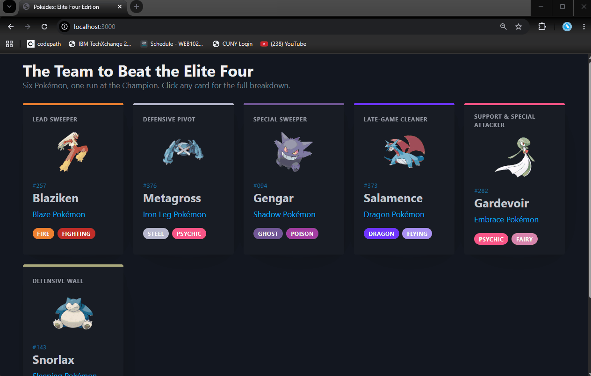

# WEB103 Project 1 - *Pokédex: Elite Four Edition*

Submitted by: **Borys Solorzano**

About this web app: **A list-based web app showcasing a six-Pokémon team built to take on the Elite Four. The home page displays each team member as a type-colored card, and clicking a card opens a detailed view with that Pokémon's full stat sheet and its role on the team.**

Time spent: **4** hours

## Required Features

The following **required** functionality is completed:

<!-- Make sure to check off completed functionality below -->
- [x] **The web app uses only HTML, CSS, and JavaScript without a frontend framework**
- [x] **The web app displays a title**
- [x] **The web app displays at least five unique list items, each with at least three displayed attributes (such as title, text, and image)**
- [x] **The user can click on each item in the list to see a detailed view of it, including all database fields**
  - [x] **Each detail view should be a unique endpoint, such as as `localhost:3000/pokemon/blaziken` and `localhost:3000/pokemon/gengar`**
  - [x] *Note: When showing this feature in the video walkthrough, please show the unique URL for each detailed view. We will not be able to give points if we cannot see the implementation*
- [x] **The web app serves an appropriate 404 page when no matching route is defined**
- [x] **The web app is styled using Picocss**

The following **optional** features are implemented:

- [x] The web app displays items in a unique format, such as cards rather than lists or animated list items

The following **additional** features are implemented:

- [x] Each card has a colored top accent and type badges driven by the Pokémon's primary type
- [x] Cards lift on hover for an interactive feel
- [x] Each item has a themed "team role" attribute (Lead Sweeper, Defensive Wall, etc.)

## Video Walkthrough

Here's a walkthrough of implemented required features:

<!-- Replace this with whatever GIF tool you used! -->
GIF created with ...  Add GIF tool here
[ScreenToGif](https://www.screentogif.com/)
<!-- Recommended tools:
[Kap](https://getkap.co/) for macOS
[ScreenToGif](https://www.screentogif.com/) for Windows
[peek](https://github.com/phw/peek) for Linux. -->

## Notes

The data currently lives in `data/pokemon.js` as an array of objects that share the same attributes, which keeps things ready for Unit 2 when this gets swapped for a real database. HTML is generated server-side with Express route handlers and template literals so there's no frontend framework involved.

## License

Copyright [2026] [Borys Solorzano]

Licensed under the Apache License, Version 2.0 (the "License"); you may not use this file except in compliance with the License. You may obtain a copy of the License at

> http://www.apache.org/licenses/LICENSE-2.0

Unless required by applicable law or agreed to in writing, software distributed under the License is distributed on an "AS IS" BASIS, WITHOUT WARRANTIES OR CONDITIONS OF ANY KIND, either express or implied. See the License for the specific language governing permissions and limitations under the License.
